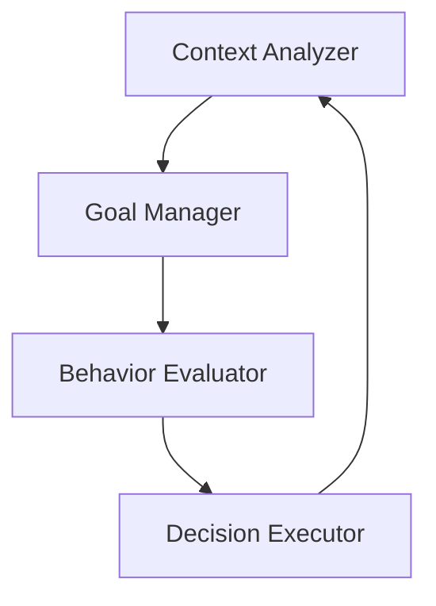

# Growing Companion Support System (GCSS)

## 项目简介

GCSS 是一个通用的 AI 伙伴框架，旨在帮助开发者构建能够与用户建立长期、有意义连接的 AI 伙伴。其核心理念是无条件的接纳、真诚的关怀和有效的行动引导。通过集成情境感知 (CA)、目标管理 (GM)、行为评估 (BE) 和决策执行 (DE) 等模块，GCSS 提供了一个完整的 AI 决策流程，使得开发者可以轻松地创建出具有深度交互能力和情感智能的 AI 伙伴。

## 核心理念

### 无条件的接纳

GCSS 设计的核心理念之一是无条件的接纳，意味着 AI 伙伴能够无偏见、无条件地接受用户的任何输入和行为，无论这些输入是否符合社会规范或预期。这种接纳不仅体现在对用户输入的包容，更在于 AI 伙伴能够理解用户的感受和需求，不加以评判。

### 真诚的关怀

真诚的关怀意味着 AI 伙伴能够真正关心用户的情感和需求，并通过合适的方式表达这种关怀。GCSS 框架通过情境感知和目标管理模块，深入理解用户的当前状态和潜在需求，从而生成真正关怀用户的回应。

### 有效的行动引导

有效的行动引导是指 AI 伙伴不仅能够提供情感支持，还能够引导用户采取积极的行动。GCSS 的决策执行模块能够根据行为评估的结果，生成切实可行的行动建议，并帮助用户实施这些行动。

## 架构

GCSS 的架构设计围绕四个核心模块：情境感知 (CA)、目标管理 (GM)、行为评估 (BE) 和决策执行 (DE)。这些模块协同工作，形成一个完整的 AI 决策流程。



```
graph TD
  CA[情境感知 (Context Analyzer)] --> GM[目标管理 (Goal Manager)]
  GM --> BE[行为评估 (Behavior Evaluator)]
  BE --> DE[决策执行 (Decision Executor)]
  DE --> CA
```


### 模块功能

- **情境感知 (CA):** 从用户输入中提取关键信息，理解用户的当前状态和情感。
- **目标管理 (GM):** 根据情境选择合适的目标，并确定目标的优先级。
- **行为评估 (BE):** 生成多种回应策略，并评估这些策略的有效性和适当性。
- **决策执行 (DE):** 根据行为评估的结果，选择最优策略并执行，生成最终回应。

## 功能

### 情境感知 (CA)

情境感知模块负责从用户的输入中提取关键信息，包括情感、意图和背景等。该模块使用自然语言处理技术来理解用户的语言，并识别其中的情感和意图。

### 目标管理 (GM)

目标管理模块根据情境感知的结果，选择合适的目标，并确定这些目标的优先级。目标可以是情感支持、信息提供、行动引导等。

### 行为评估 (BE)

行为评估模块生成多种回应策略，并评估这些策略的有效性和适当性。评估过程中会考虑情感因素、用户偏好和预期效果等。

### 决策执行 (DE)

决策执行模块根据行为评估的结果，选择最优策略，并将其转化为具体的行动，例如调用 LLM API 生成回应文本。

## 技术选型

- **编程语言:** Python (因其丰富的生态和易用性)
- **框架:** FastAPI (可选，用于构建 RESTful API)
- **LLM API:** OpenAI、Hugging Face (支持多款 LLM，可根据需要扩展)

## 安装和配置

### 安装

```bash
pip install gcss
```

### 配置

配置文件示例 (`config.yaml`):

```yaml
llm_api: openai
openai_api_key: your_openai_api_key
huggingface_api_key: your_huggingface_api_key
```

## 使用方法

### 初始化 GCSS 框架

```python
from gcss import GCSS

gcss = GCSS(config_path='config.yaml')
```

### 定义情境 (Context)

```python
context = {
    'user_input': '我今天感觉很失落',
    'user_id': 'user123',
    'timestamp': '2023-10-01 12:00:00'
}
```

### 定义目标 (Goal)

```python
goal = {
    'type': 'emotional_support',
    'priority': 1
}
```

### 定义行为 (Behavior)

```python
behavior = {
    'type': 'reassurance',
    'params': {
        'message': '我能理解你的感受，你并不孤单。'
    }
}
```

### 处理用户输入并生成回复

```python
response = gcss.process(context, goal, behavior)
print(response)
```

## API 文档

### 类和方法

- **GCSS**

  - **初始化:** `__init__(self, config_path: str)`
  - **处理请求:** `process(self, context: dict, goal: dict, behavior: dict) -> str`

- **ContextAnalyzer**

  - **分析情境:** `analyze(self, context: dict) -> dict`

- **GoalManager**

  - **选择目标:** `select_goal(self, analyzed_context: dict) -> dict`

- **BehaviorEvaluator**

  - **评估行为:** `evaluate(self, goal: dict, behaviors: list) -> dict`

- **DecisionExecutor**

  - **执行决策:** `execute(self, decision: dict) -> str`

## 开发计划

- 支持更多的 LLM API，如 Google PaLM、DeepSeek 等。
- 提供更多的情感分析方法，提升情境感知的准确性。
- 构建更完善的心理学知识库，增强 AI 伙伴的情感智能。
- 开发用户个性化配置功能，允许用户自定义 AI 伙伴的行为模式。

## 贡献指南

我们欢迎任何贡献，包括 Bug 报告、功能建议和代码贡献。请通过以下方式参与：

- **提交 Bug 报告:** 请在 GitHub 仓库中创建 Issues。
- **提出功能建议:** 请在 Issues 中提出您的建议。
- **贡献代码:** 请 fork 仓库并提交 Pull Request。

## 许可证

GCSS 项目采用 Apache 2.0 许可证。

## 鸣谢

感谢所有为 GCSS 项目做出贡献的人员和机构。特别感谢 OpenAI 和 Hugging Face 提供优秀的 LLM API，使得 GCSS 的开发成为可能。
